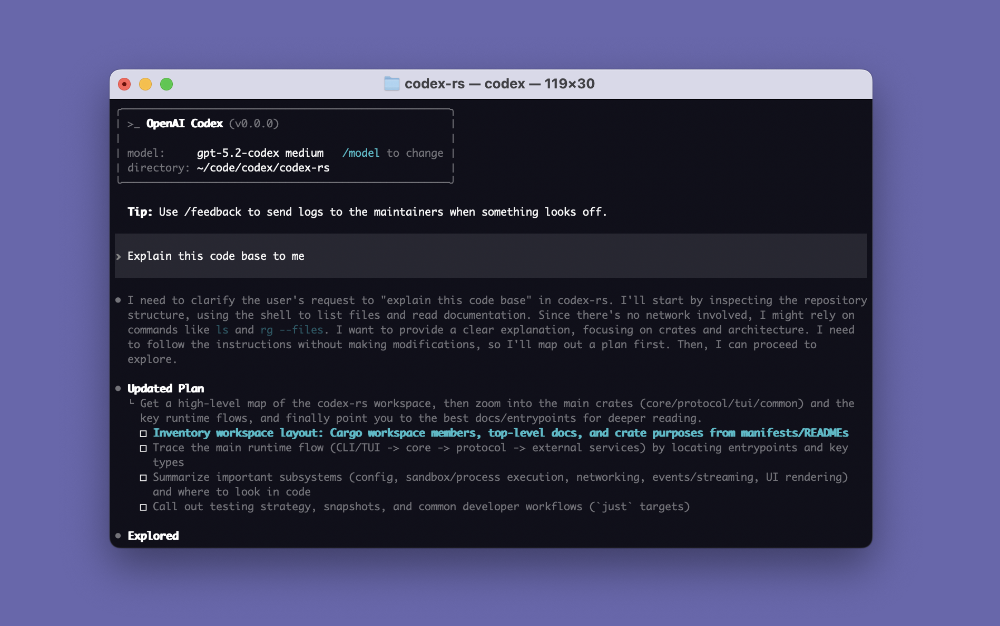

<p align="center"><code>npm i -g @openai/codex</code><br />or <code>brew install --cask codex</code></p>
<p align="center"><strong>Codex CLI</strong> is a coding agent from OpenAI that runs locally on your computer.
<p align="center">
  
</p>
</br>
If you want Codex in your code editor (VS Code, Cursor, Windsurf), <a href="https://developers.openai.com/codex/ide">install in your IDE.</a>
</br>If you are looking for the <em>cloud-based agent</em> from OpenAI, <strong>Codex Web</strong>, go to <a href="https://chatgpt.com/codex">chatgpt.com/codex</a>.</p>

---

## Quickstart

### Installing and running Codex CLI

Install globally with your preferred package manager:

```shell
# Install using npm
npm install -g @openai/codex
```

```shell
# Install using Homebrew
brew install --cask codex
```

Then simply run `codex` to get started.

<details>
<summary>You can also go to the <a href="https://github.com/openai/codex/releases/latest">latest GitHub Release</a> and download the appropriate binary for your platform.</summary>

Each GitHub Release contains many executables, but in practice, you likely want one of these:

- macOS
  - Apple Silicon/arm64: `codex-aarch64-apple-darwin.tar.gz`
  - x86_64 (older Mac hardware): `codex-x86_64-apple-darwin.tar.gz`
- Linux
  - x86_64: `codex-x86_64-unknown-linux-musl.tar.gz`
  - arm64: `codex-aarch64-unknown-linux-musl.tar.gz`

Each archive contains a single entry with the platform baked into the name (e.g., `codex-x86_64-unknown-linux-musl`), so you likely want to rename it to `codex` after extracting it.

</details>

### Using Codex with your ChatGPT plan

Run `codex` and select **Sign in with ChatGPT**. We recommend signing into your ChatGPT account to use Codex as part of your Plus, Pro, Team, Edu, or Enterprise plan. [Learn more about what's included in your ChatGPT plan](https://help.openai.com/en/articles/11369540-codex-in-chatgpt).

You can also use Codex with an API key, but this requires [additional setup](https://developers.openai.com/codex/auth#sign-in-with-an-api-key).

## Docs

- [**Codex Documentation**](https://developers.openai.com/codex)

Codex can access MCP servers. To configure them, refer to the [config docs](./docs/config.md#mcp_servers).

### Configuration

Codex CLI supports a rich set of configuration options, with preferences stored in `~/.codex/config.toml`. For full configuration options, see [Configuration](./docs/config.md).

### Execpolicy

See the [Execpolicy quickstart](./docs/execpolicy.md) to set up rules that govern what commands Codex can execute.

### Docs & FAQ

- [**Getting started**](./docs/getting-started.md)
  - [CLI usage](./docs/getting-started.md#cli-usage)
  - [Slash Commands](./docs/slash_commands.md)
  - [Running with a prompt as input](./docs/getting-started.md#running-with-a-prompt-as-input)
  - [Example prompts](./docs/getting-started.md#example-prompts)
  - [Custom prompts](./docs/prompts.md)
  - [Memory with AGENTS.md](./docs/getting-started.md#memory-with-agentsmd)
- [**Configuration**](./docs/config.md)
  - [Example config](./docs/example-config.md)
- [**Sandbox & approvals**](./docs/sandbox.md)
- [**Execpolicy quickstart**](./docs/execpolicy.md)
- [**Authentication**](./docs/authentication.md)
  - [Auth methods](./docs/authentication.md#forcing-a-specific-auth-method-advanced)
  - [Login on a "Headless" machine](./docs/authentication.md#connecting-on-a-headless-machine)
- **Automating Codex**
  - [GitHub Action](https://github.com/openai/codex-action)
  - [TypeScript SDK](./sdk/typescript/README.md)
  - [Non-interactive mode (`codex exec`)](./docs/exec.md)
- [**Advanced**](./docs/advanced.md)
  - [Tracing / verbose logging](./docs/advanced.md#tracing--verbose-logging)
  - [Model Context Protocol (MCP)](./docs/advanced.md#model-context-protocol-mcp)
  - [Terminal flash line effect](./docs/terminal-flash.md)
- [**Contributing**](./docs/contributing.md)
- [**Installing & building**](./docs/install.md)
- [**Open source fund**](./docs/open-source-fund.md)

This repository is licensed under the [Apache-2.0 License](LICENSE).
